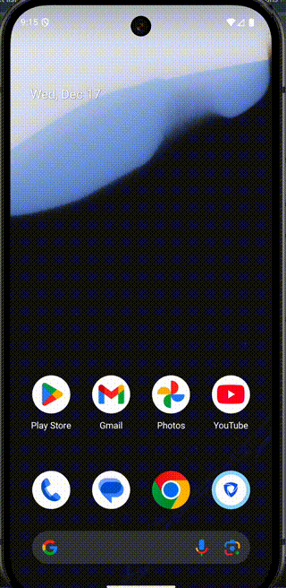
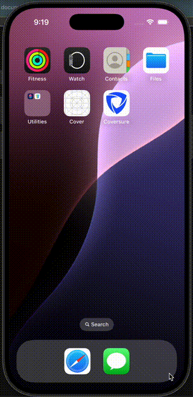

# 📱 CoverSure (React Native)

## 📌 Project Overview

A cross-platform **React Native** application that displays a list of users, allows viewing detailed user information, and supports adding/removing users from favorites.  
The app follows clean architecture principles with **MVVM-style separation**, **Redux state management**, and **Light / Dark theme support**.

---

## 🖼 Screenshots / Video Demo

### GIF

- 

- 

### Download

- Android
  [Click here to watch the demo](./demo/android_coversure.mov)

- IOS
  [Click here to watch the demo](./demo/ios_coversure.mov)

  ***

## ⚙️ Setup Instructions

### Prerequisites

- Node.js (>= 18)
- Yarn
- React Native CLI
- Android Studio
- Xcode (macOS only)
- CocoaPods

Verify:

```sh
node -v
yarn -v
npx react-native doctor
```

---

### Install Dependencies

```sh
yarn install
```

For iOS:

```sh
cd ios
pod install
cd ..
```

---

## ▶️ Running the App

### Android

```sh
yarn start
yarn android
```

### iOS

```sh
yarn ios
```

---

## 🔍 Key Decisions & Trade-offs

- Redux Toolkit for scalable state management
- MVVM-style separation for maintainability
- React Navigation for theming & navigation

---

## ⚠️ Known Limitations

- Unit tests not implemented
- Offline support not fully implemented

---

## ⏱ Time Breakdown

Total development time: **~11 hours**

| Task                                       | Time        |
| ------------------------------------------ | ----------- |
| Project setup & configuration              | 2 hrs       |
| Navigation & theming                       | 2 hrs       |
| User list & search                         | 1 hr        |
| User details screen                        | 2 hrs       |
| Favorites feature                          | 1 hr        |
| Reusable components (Loader, Empty, Error) | 2 hrs       |
| Dark mode & SVG handling                   | 30 mins     |
| Polishing & README                         | 30 mins     |
| **Total**                                  | **~11 hrs** |

---

## 📚 Libraries Used & Why

| Library                          | Purpose                     |
| -------------------------------- | --------------------------- |
| `react-navigation`               | Screen navigation & theming |
| `@reduxjs/toolkit`               | State management            |
| `react-redux`                    | Redux bindings              |
| `react-native-vector-icons`      | Icons                       |
| `react-native-svg`               | SVG illustrations           |
| `axios` / `fetch`                | API requests                |
| `react-native-safe-area-context` | Safe area handling          |

---
